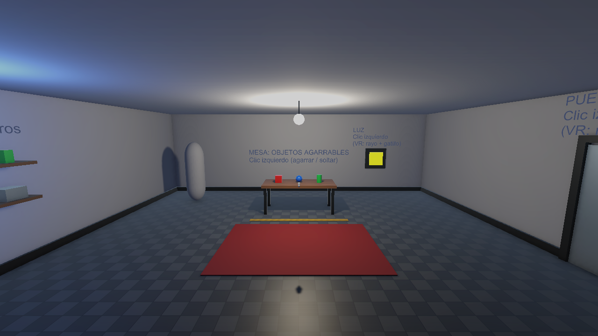
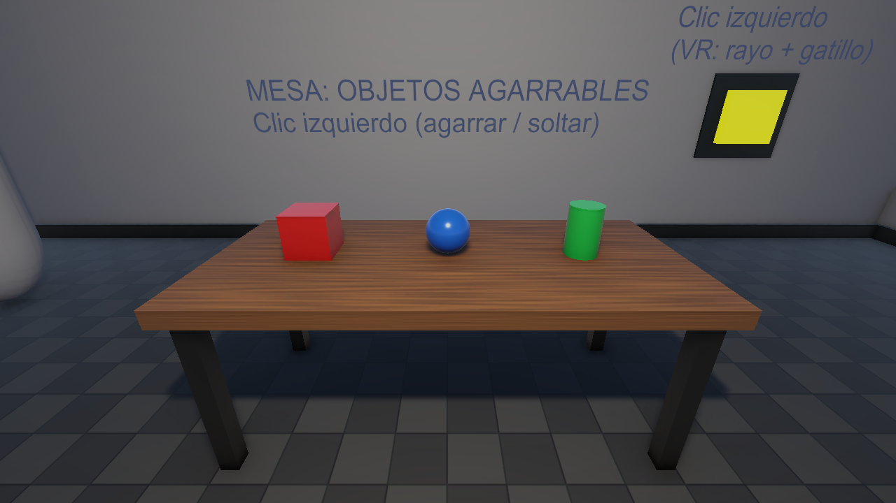
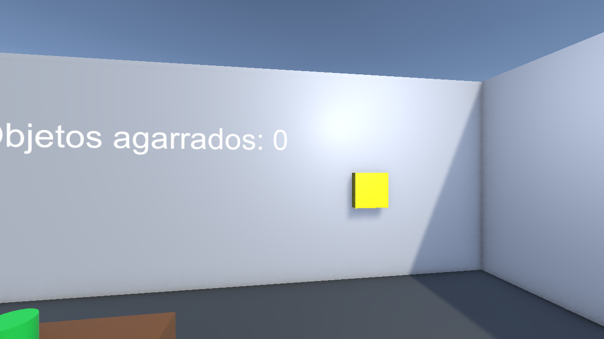
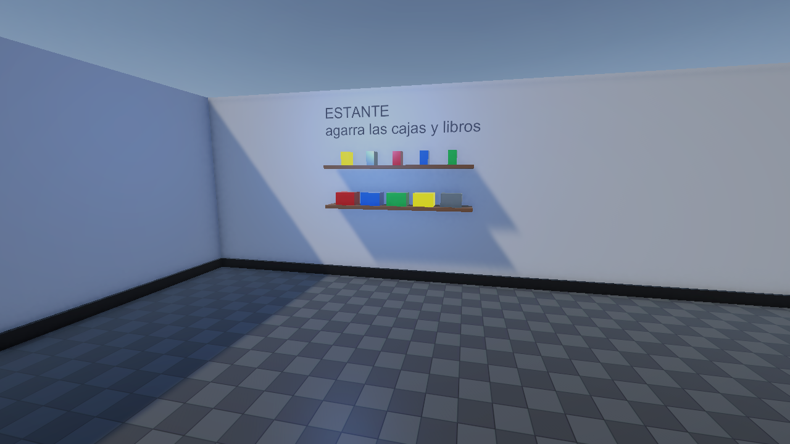
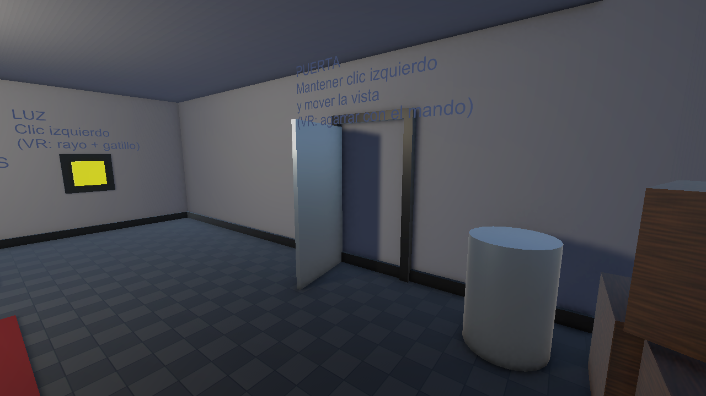
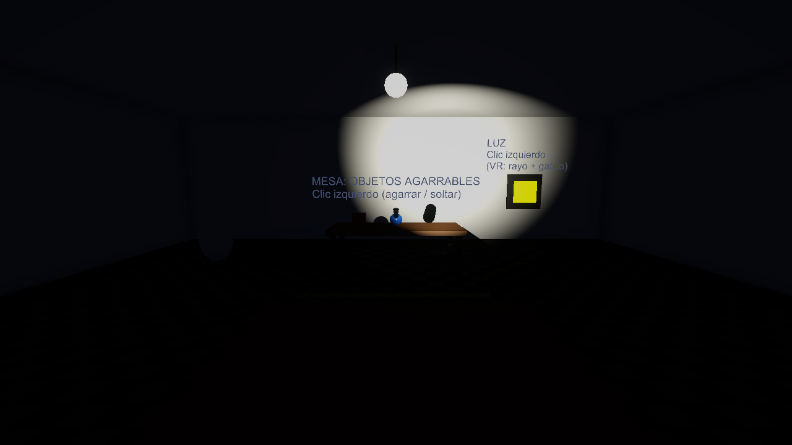

# XR Interaction Challenge

| | |
|---|---|
| **Apellidos y nombres** | Sánchez Galán Jeremy Antonio |
| **Código del estudiante** | 2221899925 |
| **Curso** | Laboratorio de Realidad Extendida (XR) para Videojuegos |
| **Docente** | Victor Alejandro Arroyo Castro |

## Descripción
Sala de entrenamiento XR cerrada, hecha con primitivas de Unity y iluminada por una lámpara colgante. Integra la configuración del entorno XR (URP + OpenXR) y la interacción con XR Interaction Toolkit: agarrar objetos con física, interactuar a distancia con un rayo, una puerta física con bisagra y teletransporte.

Escena principal: `Assets/Scenes/EC_XR_SanchezJeremy.unity`.

## Funcionalidades implementadas
- **Escenario:** piso con baldosas, techo cerrado, 4 paredes como límites, alfombra, mesa, pilar, estante, cajas, barril, marco de puerta y lámpara. Post-procesado (tonemapping, bloom, viñeta).
- **Iluminación con sentido:** la lámpara del techo es la luz principal. Al apagarla la sala queda casi a oscuras (sin luz ambiental ni reflejos), y solo se ve con la linterna.
- **Objetos manipulables (17):** cubo, esfera, cilindro, cajas, barril, y cajas y libros del estante. Todos con `Rigidbody` y `XR Grab Interactable` (`Velocity Tracking`, así colisionan con la mesa y el escenario) y se pueden lanzar.
- **Interacción a distancia:** botón amarillo en la pared; con el rayo del mando (VR) enciende/apaga la lámpara (`RayInteractionToggle.cs`).
- **Puerta física:** `Rigidbody` + `HingeJoint` (`HingedDoor.cs`). Se agarra y se mueve como una puerta real: según la velocidad con que la empujes se abre despacio o se cierra de golpe, y al soltarla conserva su impulso y choca con el tope.
- **Reto libre:** teletransporte sobre el piso (`Teleportation Area`), contador de agarres (`GrabCounter.cs`) y linterna: el cilindro verde se enciende en mano con el gatillo (`HeldFlashlight.cs`).

## Controles
**Con visor VR (OpenXR):** grip para agarrar, apuntar con el rayo y gatillo para pulsar el botón, gatillo con la linterna en mano, joystick hacia adelante para apuntar el teletransporte.

**En PC sin visor (ratón y teclado, XR Device Simulator):** al dar Play aparece el panel de comandos del simulador a la izquierda y un panel de extras a la derecha. El cursor queda bloqueado dentro de la ventana de juego (`Esc` lo libera, un clic lo vuelve a bloquear).
- `W A S D`: moverse. `Q` / `E`: bajar / subir. `Mouse`: mirar.
- `Shift izquierdo` (mantener): correr. `C` (mantener): agacharse.
- `Espacio` (mantener): controlar la **mano derecha** con el ratón. `Alt izquierdo` (mantener): **mano izquierda**.
- Con una mano activa: clic izquierdo = gatillo (pulsar botón, usar la linterna); `G` = grip (agarrar); mover el ratón mueve la mano/rayo. Para mover la puerta: agarrarla con grip y mover la mano.
- `P`: mostrar / ocultar el panel de comandos del simulador.
- `T` / `Y`: dejar fijas la mano izquierda / derecha. `Tab`: cambiar de dispositivo. `V`: reiniciar. El panel del simulador lista el resto.

Modo alternativo sin simulador: en el componente `PCMouseInteraction` (objeto `PCMouseInteraction`) cambiar `Mode` a `First Person` para una cámara en primera persona (clic izquierdo agarra/suelta, clic derecho usa la linterna, `F` teletransporta, `H` ayuda).

## Capturas

## Requisitos para abrir el proyecto
- Unity **6000.3.10f1** (Unity 6.3). Los paquetes se descargan solos al abrir el proyecto (hace falta internet la primera vez).
- Abrir la escena `Assets/Scenes/EC_XR_SanchezJeremy.unity` y pulsar Play. No hace falta visor VR.

## Video demostrativo
_(agregar enlace, máximo 1 minuto)_

## Tecnologías y paquetes
- Unity 6000.3.10f1
- Universal Render Pipeline 17.3.0
- XR Interaction Toolkit 3.6.1 (samples: Starter Assets, XR Device Simulator)
- OpenXR 1.18.0 (XR Plug-in Management)
- Input System 1.18.0
- TextMesh Pro
